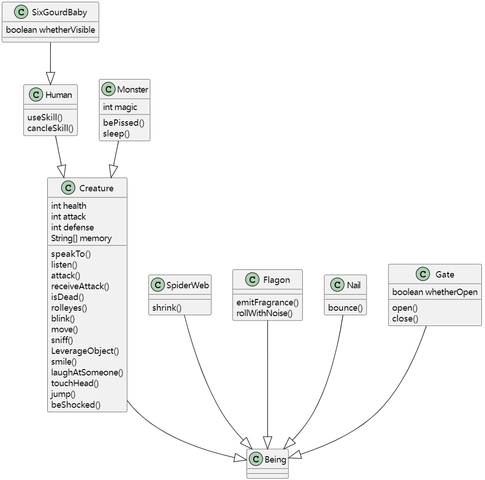
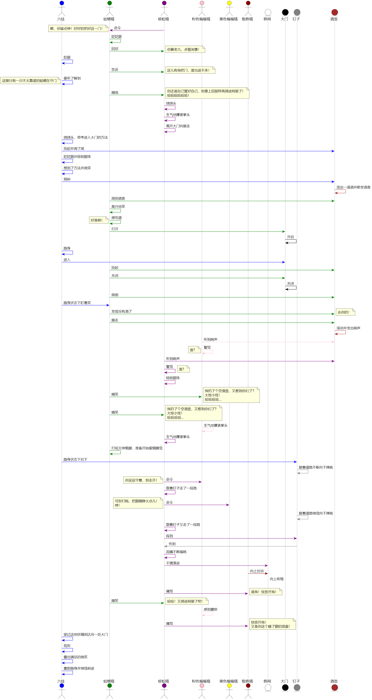

选取视频 https://www.bilibili.com/video/BV1Fk4y1V7Lf/?p=11 中 3:52~6:04 的桥段

类型设计（建模）如下：


桥段场景如下：


得到运行结果：
```
I tell homework.Monster@23fc625e'喂，你留点神，好好的把好这一门！'
I heard: 喂，你留点神，好好的把好这一门！
I am blinking.
I tell homework.Monster@3f99bd52'你算老几，多管闲事！'
I heard: 你算老几，多管闲事！
I am blinking.
I tell homework.Monster@3f99bd52'这儿有我把门，谁也进不来！'
I heard: 这儿有我把门，谁也进不来！
I heard: 这里只有蛤蟆在守门
I tell homework.Monster@3f99bd52'你还是自己管好自己，别像上回那样再掉进网里了！'
I heard: 你还是自己管好自己，别像上回那样再掉进网里了！
I laugh at homework.Monster@3f99bd52
I touch my head.
I'm so freakin pissed.
I walk a distance.
I touch my head.
I pick up homework.Flagon@4f023edb
I sniff homework.Flagon@4f023edb
I am blinking.
I roll my eyes.
I smile.
I incline homework.Flagon@4f023edb
The flagon emits a fragrance.
I sniff homework.Flagon@4f023edb
I smile.
I say:好香啊！
I open homework.Gate@3a71f4dd
The gate is open.
I'm invisible!
I enter homework.Gate@3a71f4dd
I pick up homework.Flagon@4f023edb
I close homework.Gate@3a71f4dd
The gate is close.
I dump homework.Flagon@4f023edb
I smile.
I say:去你的！
I kick away homework.Flagon@4f023edb
The flagon rolls away and makes some noise.
I heard: the noise made by the flagon
I heard: the noise made by the flagon
I tell homework.Monster@23fc625e'谁？'
I heard: 谁？
I tell homework.Monster@23fc625e'谁？'
I heard: 谁？
I walk a distance.
I'm visible now!
I smile.
I'm invisible!
I walk a distance.
```